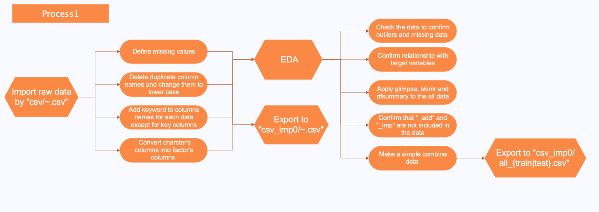

<!-- START doctoc generated TOC please keep comment here to allow auto update -->
<!-- DON'T EDIT THIS SECTION, INSTEAD RE-RUN doctoc TO UPDATE -->
**Table of Contents**  *generated with [DocToc](https://github.com/thlorenz/doctoc)*

- [Reference](#reference)
  - [Technics](#technics)
- [Flow Chart](#flow-chart)
- [Home_Credit_Kaggle](#home_credit_kaggle)
  - [Rmd.file](#rmdfile)
  - [jn.file](#jnfile)
  - [py.file](#pyfile)
  - [script.file](#scriptfile)
  - [submit.file](#submitfile)
  - [input](#input)
    - [csv.file](#csvfile)
    - [csv_imp0.file](#csv_imp0file)
    - [csv_imp1.file](#csv_imp1file)
  - [data.file](#datafile)
- [Layered Directory](#layered-directory)

<!-- END doctoc generated TOC please keep comment here to allow auto update -->

# Reference

- [Kaggle:How to LightGBM with lightgbm.cv](https://www.kaggle.com/shep312/lightgbm-harder-better-slower/code)
- [Python API](https://lightgbm.readthedocs.io/en/latest/Python-API.html)
- [roc auc score](http://scikit-learn.org/stable/modules/generated/sklearn.metrics.roc_auc_score.html0)
- [1st place solution](https://www.kaggle.com/c/home-credit-default-risk/discussion/64821)
- [2nd place solution](https://www.kaggle.com/c/home-credit-default-risk/discussion/64722)
- [many good technics (Japanese)](https://github.com/nyanp/kaggle-homecredit)
- [Feather packege](https://blog.rstudio.com/2016/03/29/feather/)

## Technics

- Important thing is good set of smart features and diverse set of base algorithms.
- A lot of features based on division and substraction from the application_train.csv
    - The most notable division was by EXT_SOURCE_3
- The most important features that I engineered, in descending order of importance (measured by gain in the LGBM model)
- Find data structure, understand column description, mannagement of the feature

# Flow Chart



# Home_Credit_Kaggle

## Rmd.file

- 0_EDA.Rmd: Checking data simply and searching problem
- 1_Preprocess_app.Rmd: Preprocessing for application_{train|test}.csv
- 1_Preprocess_bureau.Rmd: Preprocessing for bureau.csv and bureau_balance.csv (not changed)
- 1_Preprocess_pre_app.Rmd: Preprocessing for previous_applications.csv (not changed)
- 1_Preprocess_ins_pay.Rmd: Preprocessing for installments_payment.csv (not changed)
- 1_Preprocess_pos_cash.Rmd: Preprocessing for POS_CASH_balance.csv (not changed)
- 1_Preprocess_credit.Rmd: Preprocessing for credit_card_balance.csv (not changed)
- 2_Combine.Rmd: Combining all data and Checking for data (not changed)
- 3_XGBoost.Rmd: construct xgboost model, predict, make a submit file, search best features, parameter tune (not changed)

## jn.file

- LightGBM.ipynb: lightgbm, cross validation, predict

## py.file

## script.file
 
- function.R: Descrive detail of functions
- makedummies.R: Make factor values dummy variables 
	 
## submit.file

- file_name + submit_date.csv 

## input

### csv.file

- raw data

### csv_imp0.file

- {...}.csv: Apply basic preprocess
- all_{train|test}.csv: Combine all tables

### csv_imp1.file

- {...}_imp.csv: Complement missing values, Extract features
- all_{train|test}.csv: Combine all tables

## data.file

- xgb.importanceにより効果のある特徴量を記録する(best_para.tsv)
- 様々な特徴量を追加する前の優れた特徴量の記録, boxにおけるcsv_imp_0820データに実行(best_para_old_100.tsv)
- train auc, test auc, LB score 等をメモ形式で保存(score_sheet.tsv)
- Flowchart.eddx, FlowChart.png: Illustrate the process chart
- about_column.numbers: Explain all table columns
    
# Layered Directory
 
```
├── Home_Credit_Kaggle.Rproj
├── README.md
├── Rmd
│   ├── 0_EDA.Rmd
│   ├── 1_Preprocess_app.Rmd
│   ├── 1_Preprocess_app.html
│   ├── 1_Preprocess_bureau.Rmd
│   ├── 1_Preprocess_credit.Rmd
│   ├── 1_Preprocess_ins_pay.Rmd
│   ├── 1_Preprocess_pos_cash.Rmd
│   ├── 1_Preprocess_pre_app.Rmd
│   ├── 2_Combine.Rmd
│   └── 3_XGBoost.Rmd
├── input
│   ├── csv
│   │   ├── HomeCredit_columns_description.csv
│   │   ├── POS_CASH_balance.csv
│   │   ├── application_test.csv
│   │   ├── application_train.csv
│   │   ├── bureau.csv
│   │   ├── bureau_balance.csv
│   │   ├── credit_card_balance.csv
│   │   ├── installments_payments.csv
│   │   ├── previous_application.csv
│   │   └── sample_submission.csv
│   ├── csv_imp0
│   │   ├── all_data_test.csv
│   │   ├── all_data_train.csv
│   │   ├── POS_CASH_balance.csv
│   │   ├── application_test.csv
│   │   ├── application_train.csv
│   │   ├── bureau.csv
│   │   ├── bureau_balance.csv
│   │   ├── credit_card_balance.csv
│   │   ├── installments_payments.csv
│   │   └── previous_application.csv
│   └── csv_imp1
│       ├── all_data_test.csv
│       ├── all_data_train.csv
│       ├── application_test_imp.csv
│       ├── application_train_imp.csv
│       └── credit_card_balance_imp.csv
├── data
│   ├── best_para.tsv
│   ├── best_para_old_100.tsv
│   ├── about_column.numbers
│   ├── FlowChart.eddx
│   ├── FLowChart.png
│   └── score_sheet.tsv
├── jn
│   ├── LightGBM.ipynb 
│   └── 
├── py
│   ├──  
│   └── 
├── submit
└── script
   ├── function.R
   └── makedummies.R 
```
